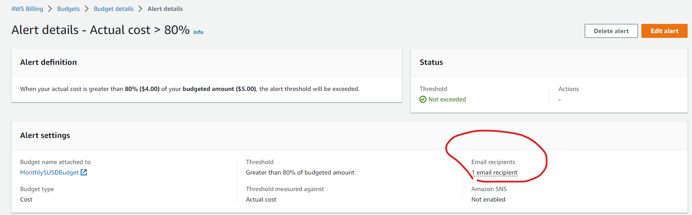

# Week 0 — Billing and Architecture
## Set a Billing alarm
I have set up a billing alarm to notify me via email when the bill hits USD 5. It will first notify me when it reaches more than 80% of USD 5 so that I won't be shocked about the credit card bills at the end of each month.

## Set a AWS Budget
As mentioned above, I have an AWS Budget configured set for USD 5. It will notify me when it reaches more than 80% of the budgeted USD 5 via email.

## Generating AWS Credentials
I have generated AWS credentials using the AWS console. The AWS credentials consists of AWS Access Key and Secret access key. I can use both the keys to access AWS services through AWS CLI and AWS SDK. This is so that I don't have to navigate around AWS Console everytime and can just use CLI to interact and manage AWS services.

## Using CloudShell 

## Conceptual Architecture Diagram or your Napkins

## Stop using your root account credentials, Set MFA, IAM users and IAM roles