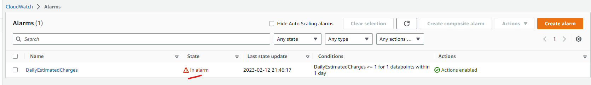

# Week 0 — Billing and Architecture
## Set a Billing alarm
I have created an AWS CloudWatch Billing alarm that will be triggered if the daily estimated charges exceeds $1. The notifications will be published to an AWS SNS Topic which my email has subscribed to it for the alerts. To be honest, I thought the billing alarm is just a notification alerts under AWS Budget, but apparently it's different and it's using AWS CloudWatch.

## Set a AWS Budget
As mentioned above, I have an AWS Budget configured set for USD 5. It will notify me when it reaches more than 80% of the budgeted USD 5 via email.

## Generating AWS Credentials
I have generated AWS credentials using the AWS console. The AWS credentials consists of AWS Access Key and Secret access key. I can use both the keys to access AWS services through AWS CLI and AWS SDK. This is so that I don't have to navigate around AWS Console everytime and can just use CLI to interact and manage AWS services. I have also configured it as environment PATH variables so that my GitPod instance remembers my AWS credentials.

## Using CloudShell 
I have also tried AWS CloudShell in the AWS console. But ultimately Andrew decides that we should do everything in our GitPod workspace. I also found out that my home region ap-southeast-1 Singapore doesn't have AWS cloudshell. So I had to go to the other region like us-east-1 to access the AWS cloudshell.

## Conceptual Architecture Diagram or your Napkins

## Stop using your root account credentials, Set MFA, IAM users and IAM roles
I have stopped using my root account and is using IAM user that I created to do all the AWS related operations. I have also set up MFA using Authy authenticator so that both my PC and mobile have access to my 2FA code, providing more convenience when I do not have access to one of them. I gave my IAM user Administrator Access rights as I am using it as a legitimate administrator just that I am not using the root account. I put the IAM User under IAM group Admin and allow possible expansions to other kind of IAM groups such as developers and finance groups.